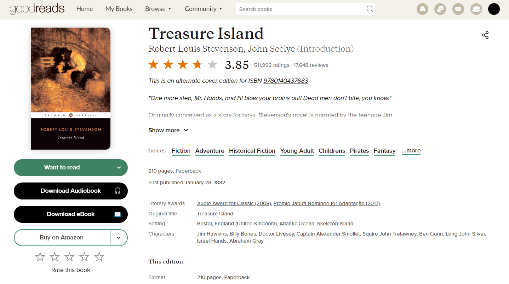

# Goodreads Download Buttons for Chromium-based Browsers

A browser extension that adds download buttons to book pages on Goodreads and automatically queries Anna's Archive, Libgen and AudioBook Bay. Works with any Chromium-based browser (tested on Google Chrome and Microsoft Edge). For a Firefox version check [this fork](https://github.com/Cpmjaguar1234/goodreads-download-buttons-firefox/tree/master).

 
  
Screenshot 

   

## Features

- Automatically adds download buttons to every book page on Goodreads
- Left click on the Audiobook button searches AudioBook Bay
- Left click on the eBook button searches Anna's Archive
- Right click on the eBook button searches Libgen as a fallback
- Clean integration with Goodreads' native UI
- No data collection or tracking

## How to install

This extension is not published to any extension stores. Simply clone this repository (or download and unzip it somewhere on your computer) and use the [Load Unpacked](https://developer.chrome.com/docs/extensions/get-started/tutorial/hello-world#load-unpacked) option on your browser settings to load it.

## Legal Notice

This extension only provides search shortcuts. Users are responsible for ensuring they only download content they have the right to access.

## Contributing

Feel free to open issues or submit pull requests if you find any bugs or have suggestions for improvements. 
